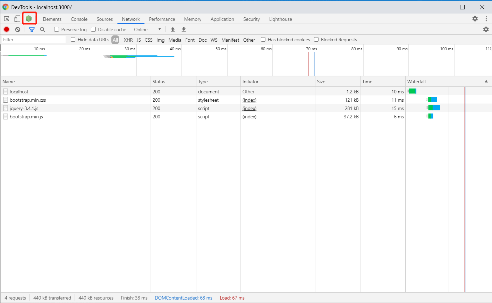
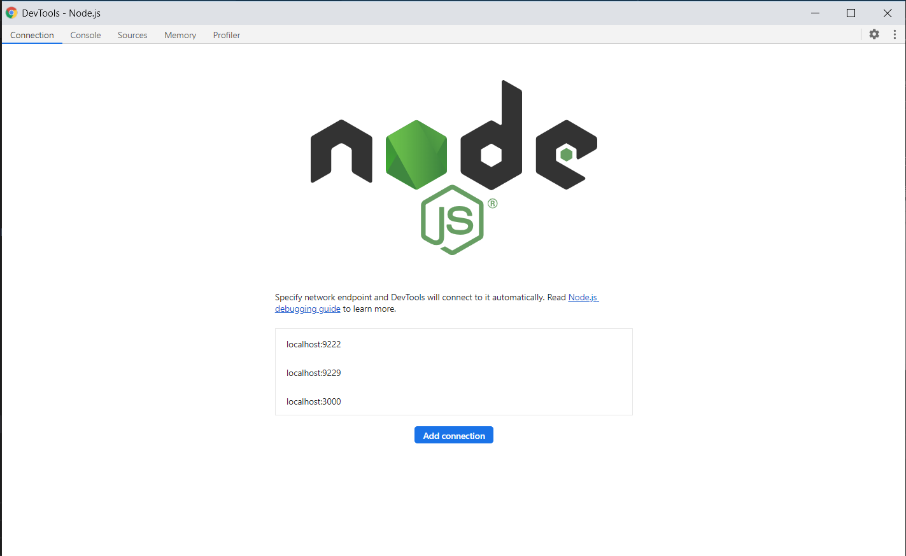

* 在开发环境下，关闭缓存后，我们修改View，可以直接刷新浏览器看到效果（但是仅仅是修改View刷新可以看到效果，修改Model刷新也还是看不到效果的）

* 用nodemon启动项目，可以实现热部署，也就是修改了Controller，直接刷新浏览器也可以看到效果(nodemon app)

* 用nodemon启动项目怎么断点调试？
  + nodemon --inspect app 80启动项目

  + F12打开浏览器Inspector，可以看到
  

  + Click Node icon，会打开一个新的Window
  

  + 看看项目地址在不在列表里边，如果不在，click 'Add connection'

  + Click 'Sources' Tab，添加一个断点，刷新浏览器，断点成功命中
  

* Node项目打包？可以用webpack打包吗？
  + 如何支持import
  + Node现在已经支持对象展开运算符了
    ```javascript
    const user = { name: 'tom' }
    const user1 = { ...user, ...{ age: 25 } }
    ```

* Node可以用Typescript写吗？

* git commit --amend之后出现的填写提交message的界面，之后要怎么操作？
    
    这是 vim 编辑器，退出需要先按 <kbd>ESC</kbd>，再打 :wq，<kbd>Enter</kbd>
    